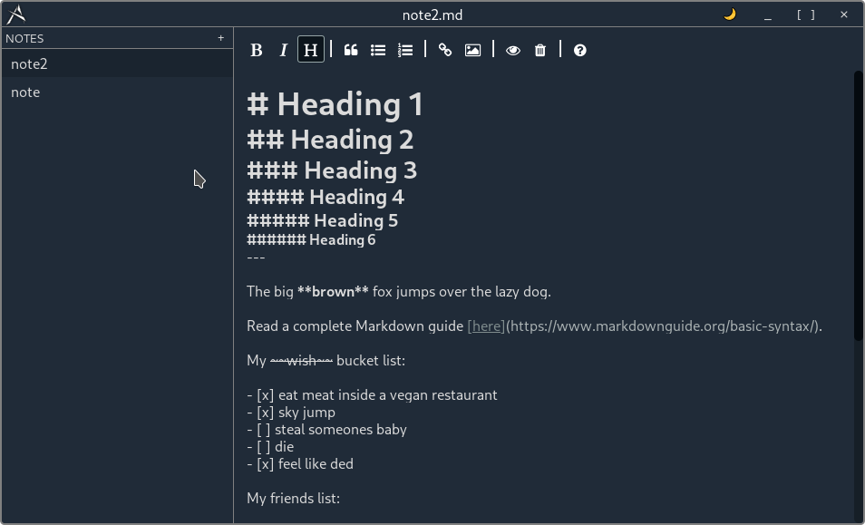

# arkane

A Markdown-based note-taking app written with Tauri + Vue.

## Roadmap

The app is pretty much working now; add new note, live saving content, delete app. Notes can be found in `Documents > arkane`.

- [ ] First release (at least build an AppImage)
- [ ] Allow image on preview
- [ ] Mobile (can I? Does Tauri can?)
- [ ] Renaming notes
- [ ] Add spellchecker toggle on the editor toolbar
- [ ] Refactor disgusting codes

## Contributing

I'm an amateur web developer, comments or code for improvements are highly appreciated!

### Recommended tools

- [VS Code](https://code.visualstudio.com/) + [Volar](https://marketplace.visualstudio.com/items?itemName=Vue.volar) + [Tauri](https://marketplace.visualstudio.com/items?itemName=tauri-apps.tauri-vscode) + [rust-analyzer](https://marketplace.visualstudio.com/items?itemName=rust-lang.rust-analyzer)

### Type Support For `.vue` Imports in TS

Since TypeScript cannot handle type information for `.vue` imports, they are shimmed to be a generic Vue component type by default. In most cases this is fine if you don't really care about component prop types outside of templates. However, if you wish to get actual prop types in `.vue` imports (for example to get props validation when using manual `h(...)` calls), you can enable Volar's Take Over mode by following these steps:

1. Run `Extensions: Show Built-in Extensions` from VS Code's command palette, look for `TypeScript and JavaScript Language Features`, then right click and select `Disable (Workspace)`. By default, Take Over mode will enable itself if the default TypeScript extension is disabled.
2. Reload the VS Code window by running `Developer: Reload Window` from the command palette.

You can learn more about Take Over mode [here](https://github.com/johnsoncodehk/volar/discussions/471).

## License

MIT

## Logo

A simple logo created from random points using Figma. Pointy, just to make it look cool.

## Development

Still a work in progress, and probably gonna be a toy app only.
